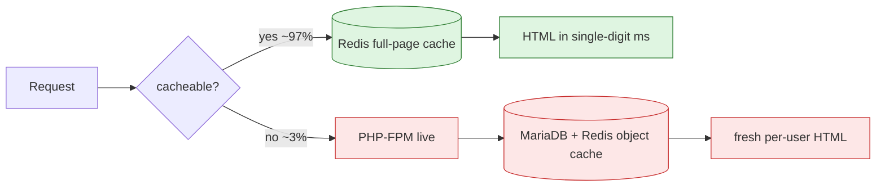

# heavy-traffic-caching-stack

**A reproducible, hybrid full-page caching architecture that serves a
high-traffic WordPress/PHP site from a small, cheap node, without breaking the
dynamic features (logins, live comments, carts) that a naive cache would.**

> Distilled from a production content platform serving **~300,000 unique
> visitors/day (~9M/month) on a single 4-vCPU node**, with a measured
> **~97% full-page cache hit ratio**. This repo is a clean, open-source
> reproduction of that architecture. No proprietary code or content, just the
> method, runnable with one command.

[](LICENSE)


---

## The problem

"Just turn on full-page caching" works right up until your site does anything
real. Cache everything and you serve one logged-in user's page to the next
visitor, show a stale comment thread, or leak a cart. Cache nothing and PHP +
the database fall over the moment traffic spikes.

The interesting engineering is not the cache. It's **where you draw the line
between what is cached and what stays live.** Get that line right and a €5/month
class of hardware absorbs an audience that would otherwise need a small fleet.

## The approach: a hybrid cache

Every request is classified, in nginx, before it reaches the application:

- **Anonymous, idempotent reads** get served as full HTML straight from
  **Redis**. PHP and MariaDB are never touched. This is ~97% of traffic.
- **Logged-in / cart / checkout / admin / API / AJAX / authenticated** requests
  **bypass the cache entirely** and render live, every time.



The decision logic lives in [`nginx/conf.d/cache-map.conf`](nginx/conf.d/cache-map.conf):
readable, commented rules over cookies, URIs, auth headers, and query strings.
The full walk-through is in [`docs/architecture.md`](docs/architecture.md).

## Measured impact

| Metric | Production reference |
| --- | --- |
| Daily audience on one 4-vCPU node | **~300k uniques/day (~9M/mo)** |
| Full-page cache hit ratio | **~97%** |
| Steady-state load average | well under 1.5 across 4 cores |
| Resident cache | ~1M objects in ~1 GB, `allkeys-lru` bounded at 1.5 GB |

> Because the cache absorbs ~97% of requests, PHP only ever sees the ~3% that is
> genuinely dynamic. At ~150 req/s peak that is roughly 4 to 5 renders/s, well
> under one busy worker against a pool of 30 (about 40x headroom). The daily
> audience and the hardware bill stop being correlated. Full math:
> [`docs/architecture.md`](docs/architecture.md#capacity-model-why-a-4-vcpu-box-absorbs-this).
> Methodology and how-to-reproduce: [`docs/benchmarks.md`](docs/benchmarks.md).

## Built to fail gracefully, not just to be fast

A cache that only works on the happy path turns "slow" into "down". Every
failure mode here degrades to **slower**, never to **down**, and every
degradation is **bounded**:

- **Redis down or slow:** fail open. srcache treats it as a MISS and renders
  live, and fail-fast upstream timeouts mean a sick cache never hangs a request.
- **Cache stampede:** TTL jitter (`set_random`) de-synchronises mass expiry, and
  a bounded PHP pool caps the herd. ([the honest limit, and the next step](docs/failure-modes.md#1-the-thundering-herd-cache-stampede))
- **PHP saturated:** deliberate load-shedding. A fast 503 plus a static offline
  page instead of a swap-death spiral, and it recovers automatically.
- **Stale content:** two clocks. Event-purge for immediacy plus a TTL backstop,
  so a missed purge is bounded, never permanent.

Full write-up: [`docs/failure-modes.md`](docs/failure-modes.md).

## Run it yourself

```bash
git clone https://github.com/julliuzsam/heavy-traffic-caching-stack
cd heavy-traffic-caching-stack
cp .env.example .env
make up          # nginx + PHP/WordPress + MariaDB + Redis, one command
                 # then finish the WordPress install at http://localhost:8080
make bench       # mixed anonymous + logged-in load test (k6)
make hitratio    # watch the live Redis hit ratio climb
```

Requirements: Docker + Docker Compose, and [k6](https://k6.io/) for the load
tests. The `make bench` run asserts that anonymous traffic is cached **and** that
logged-in traffic is not, so the architecture is verified, not just claimed.

## What's in here

| Path | What it is |
| --- | --- |
| `nginx/conf.d/cache-map.conf` | The cached-vs-live decision logic (the core idea) |
| `nginx/sites/wordpress.conf` | srcache to Redis pipeline, with TTL jitter, fail-open, load-shedding |
| `nginx/conf.d/upstream.conf` | Upstreams with fail-fast timeouts so a sick cache degrades gracefully |
| `redis/redis.conf` | Redis tuned as a disposable, bounded cache |
| `mariadb/tuned.cnf` | InnoDB sized for the cache-miss tail; query cache off |
| `php/www.conf` | PHP-FPM pool sized to the miss rate, not the request rate |
| `load/k6-mixed.js` | Realistic 90/10 anonymous/logged-in load test |
| `load/k6-anon.js` | Peak cached-throughput test |
| `scripts/cache-hitratio.sh` | Live hit-ratio from the nginx log (HIT/MISS/BYPASS) |
| `scripts/warm-cache.sh` | Post-deploy cache warmer (avoids cold-start stampede) |
| `docs/architecture.md` | The design in depth: request flow, capacity model, trade-offs |
| `docs/failure-modes.md` | Thundering herd, Redis-down, load-shedding, invalidation races |
| `docs/observability.md` | What to measure and alert on (leading vs lagging signals) |
| `docs/benchmarks.md` | Numbers, methodology, how to reproduce |

## Design principles

1. **Cache the audience, not the user.** Anonymous reads are shared; anything
   carrying identity or state is never cached.
2. **Bound everything.** Memory cap + LRU on Redis, fixed PHP worker ceiling,
   InnoDB pool sized to the working set. The system degrades gracefully under a
   spike instead of swapping to death.
3. **Make the cache decision observable.** `X-Cache-Status` on every response and
   `$srcache_fetch_status` in the access log, so you can always see *why* a
   request was or wasn't cached.
4. **Invalidate on two clocks.** Short TTL for self-healing + event purge for
   immediacy. Neither alone is safe.
5. **Monitor the mechanism, not the symptom.** Hit ratio and FPM worker
   saturation are *leading* indicators: they move while there's still headroom
   to react, unlike page latency, which only moves once users already feel it.

> Knowing where this design is the **wrong** tool (per-user SaaS dashboards,
> payment ledgers, live inventory) is part of the job. See the
> [trade-offs section](docs/architecture.md#trade-offs-when-this-is-the-wrong-tool).

---

### About

I build and operate high-traffic infrastructure: caching, performance, database
tuning, and cost/reliability engineering for sites that need to handle a lot of
traffic without a lot of hardware.

**Available for freelance: performance and infrastructure consulting.**
[Get in touch](https://www.linkedin.com/in/jellesamaey/) · MIT licensed, use freely.
