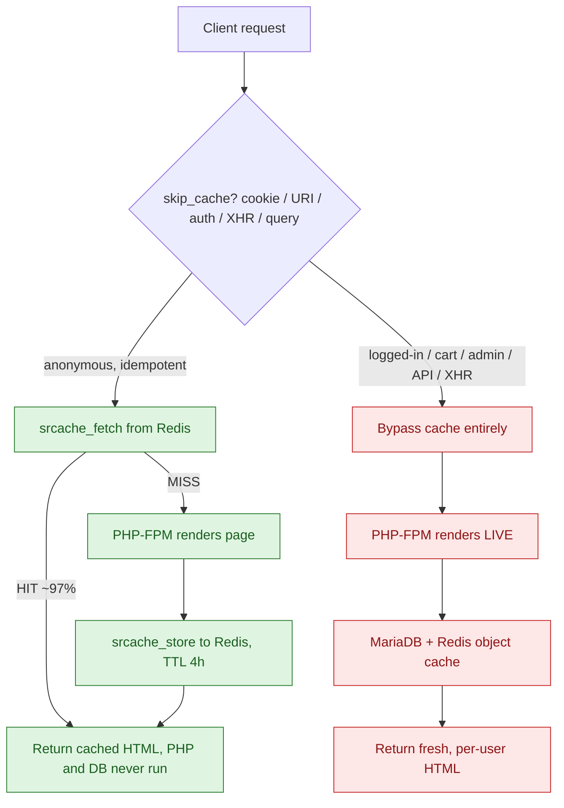

# Architecture: a hybrid full-page cache

The cheap, naive way to make WordPress fast is a static full-page cache: render
every page once, serve the HTML to everyone. It falls apart the moment the site
has anything dynamic: a logged-in state, live comments, a cart, per-user
content. You either cache those and serve one user's data to another, or you
disable caching and melt under load.

This stack takes the **hybrid** path. Cache aggressively for the traffic that is
safe to cache, and let everything else fall through to the live application,
decided per request, by rule.

## Request flow



Green is the cached path: the request never touches PHP or MariaDB. Red is the
live path: every byte is rendered fresh for that specific user. The skill is not
"turning on caching", it is drawing the green/red line in exactly the right
place, so the green path is as wide as possible without ever serving someone
else's state.

## What stays live, and why

| Signal | Example | Why it must bypass |
| --- | --- | --- |
| Auth/session cookie | `*_logged_in`, `sessionid` | Response is scoped to a user |
| Commenter cookie | `comment_author_*` | Live comment identity + moderation state |
| Cart/commerce cookie | `items_in_cart`, `cart_hash` | Per-user, changes every action |
| `Authorization` header | API/Bearer tokens | Principal-scoped by definition |
| Dynamic URI | `/cart/`, `/account/`, `/admin/`, `/api/` | State-changing or private |
| `XMLHttpRequest` | AJAX fragments | Personalised partials |
| Non-attribution query string | `?add-to-cart=...`, `?s=...` | Unbounded key space / actions |

Everything else, the anonymous article view that is the same for every visitor,
is cacheable, and that is the overwhelming majority of traffic on a content site.

## Why each layer exists

- **nginx + srcache + Redis (full-page cache).** The full rendered HTML is stored
  in Redis keyed by `scheme+method+host+uri`. On a hit, nginx returns the bytes
  directly; PHP and MariaDB are never invoked. This is what turns a request rate
  the application could never sustain into a request rate the *reverse proxy*
  handles trivially. Hit ratio in production sits around **97%**.

- **Redis as object cache too.** On the live path, WordPress uses the same Redis
  for its object cache (query results, transients), so even cache *misses* and
  logged-in renders avoid repeating expensive queries.

- **PHP-FPM (bounded).** Sized to the *miss* rate, not the request rate. Because
  the cache absorbs ~97% of traffic, a small, fixed pool of workers is enough,
  and a fixed ceiling sheds load with a fast 503 instead of swap-death.

- **MariaDB (tuned for the tail).** Sees only misses, writes, and logged-in
  traffic. Tuned to keep the working set in RAM (InnoDB buffer pool), with the
  legacy query cache disabled because Redis already owns that job.

## Capacity model: why a 4-vCPU box absorbs this

The whole design is justified by one back-of-envelope calculation. Treat it as
the sizing method, not a fixed result:

```
Audience           ~300k uniques/day, peaking ~5x average  ->  ~150 req/s at peak
Hit ratio          97%   ->  misses reaching PHP =  3% x 150 ~= 4.5 req/s
Avg render (miss)  ~150 ms with a warm object cache
Workers needed     4.5 req/s x 0.15 s ~= 0.7 busy workers (Little's Law)
Pool ceiling       pm.max_children = 30   ->   ~40x headroom over steady state
```

The cached 97% never touches PHP at all. nginx answers it from Redis in
single-digit milliseconds, and a single core serves thousands of those per
second. So the box is not sized for 150 req/s of *rendering*; it is sized for
~5 req/s of rendering plus a lot of cheap proxy work. **That** is how the daily
audience and the hardware bill stop being correlated. Raise the miss rate (lower
hit ratio) and the worker math is what breaks first, which is why hit ratio is
the number that gets monitored (see [`observability.md`](observability.md)).

## Cache invalidation

The hard part of any cache. Two complementary mechanisms:

1. **TTL.** Every stored page expires after 4h, so stale content self-heals
   even if nothing explicitly purges it.
2. **Event purge.** On content publish/update, the application deletes the
   matching `fullpage:*` key(s) from Redis, so edits appear immediately rather
   than waiting out the TTL.

A short TTL alone would hammer PHP on popular pages; event-purge alone risks
permanent staleness if a purge is missed. Together they bound both worst cases.

## Scaling notes

- The full-page cache makes the app tier **horizontally trivial**: PHP nodes are
  stateless, Redis holds shared cache state, so you add workers/nodes linearly.
- Static and heavy media (images, video) belong on a **separate origin or CDN**
  with its own bandwidth budget, not on the application node, keeping the app
  node's NIC and CPU free for HTML.

## Trade-offs: when this is the wrong tool

No architecture is free. This one is deliberately specialised, and a senior
choice is knowing where it does *not* apply:

- **It assumes a high cacheable:dynamic ratio.** A content/media/marketing site
  is mostly anonymous reads, which is ideal. A logged-in SaaS dashboard where
  every page is per-user gets ~0% full-page hit ratio; there the win is
  object/fragment caching and query tuning, not full-page caching. Same toolbox,
  different layer.
- **`flush_log_at_trx_commit = 2` trades durability for throughput.** Correct for
  comments and content; **wrong** for a payment ledger or anything where losing
  ~1s of writes on an OS crash is unacceptable. Know which system you are tuning.
- **Eventual consistency on cached pages.** A visitor can see a page up to the
  purge-or-TTL window old. Fine for articles; not for a stock ticker or live
  inventory count, which belong on the dynamic path or behind a short-TTL
  fragment.
- **Single-node simplicity.** This repo models one app node for clarity. The
  design scales horizontally (stateless PHP + shared Redis), but multi-node adds
  cache-coherency and purge-fan-out concerns that are out of scope here.

## Further reading in this repo

- [`failure-modes.md`](failure-modes.md): the thundering herd, Redis-down
  fail-open, PHP load-shedding, invalidation races.
- [`observability.md`](observability.md): what to measure and alert on.
- [`benchmarks.md`](benchmarks.md): numbers, methodology, how to reproduce.
